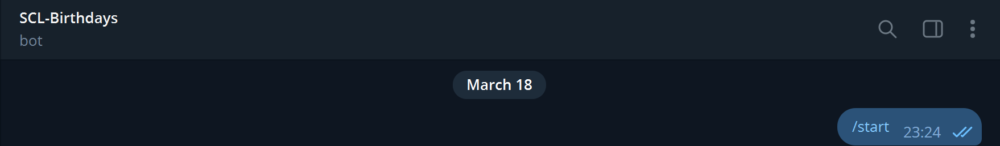
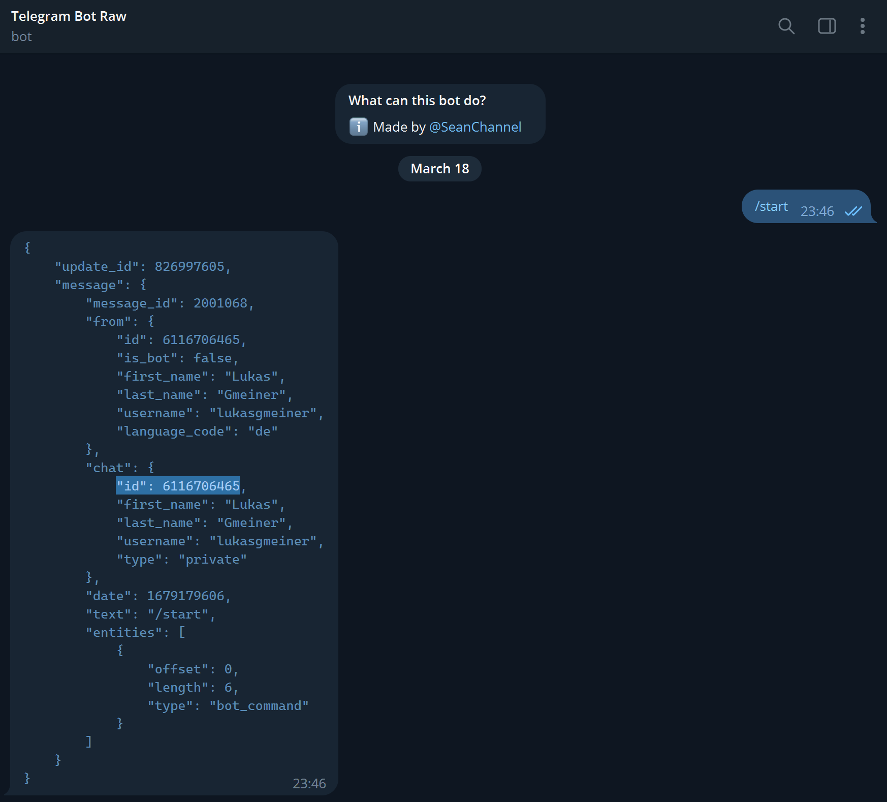
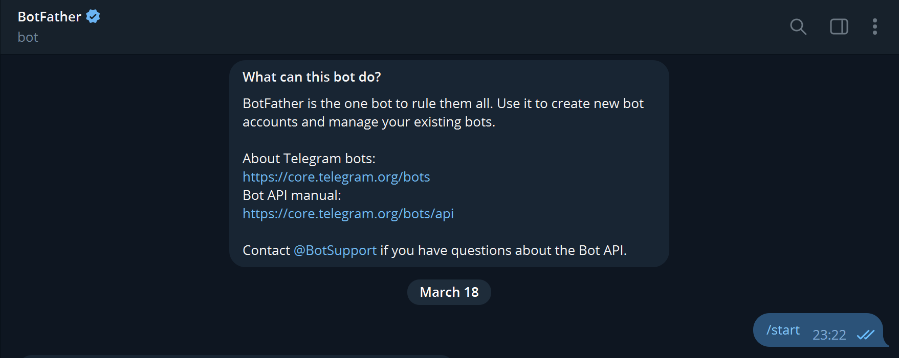
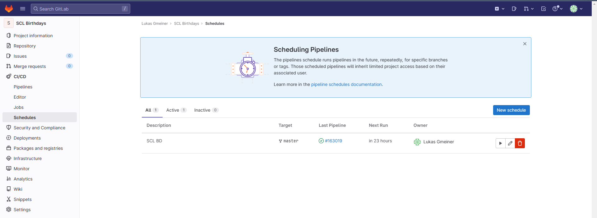
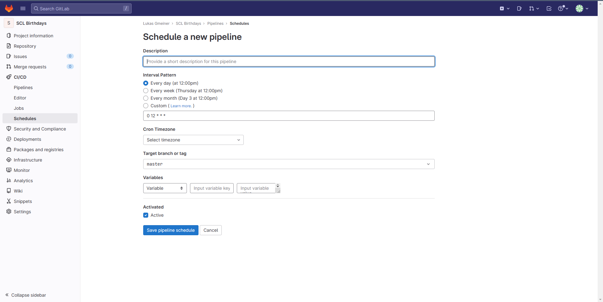
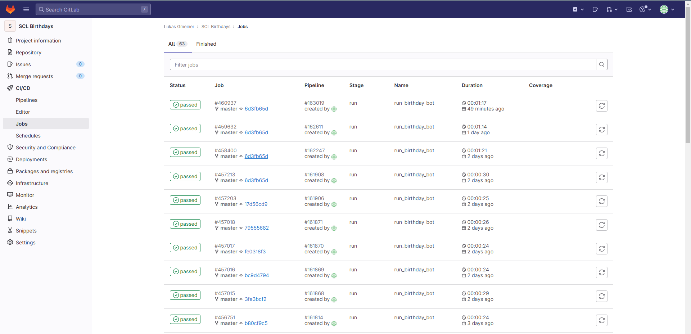
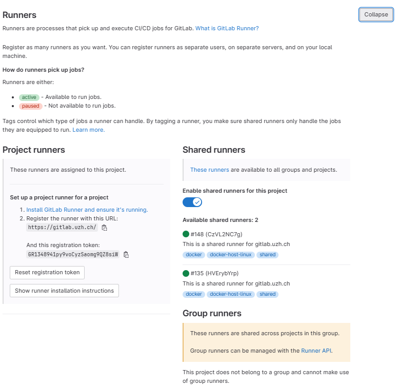

# SCL Birthdays

Welcome to the SCL Birthdays repository, a Python code that simplifies the process of sending personalized birthday messages to selected receivers on their special day. The receivers' data is stored in an Excel file that needs to be updated with the current birthday data. The code is designed to be easy to use, and we hope it helps you make birthday celebrations a little more special. Thank you for your interest in the SCL Birthdays repository, and we hope you find it useful!

## Update Excel File

To exchange the existing [Excel file](Birthday.xlsx), simply download it from Gitlab and update it with the new birthday and changed status of the students. After that you can replace the existing file with the new one. Make sure to keep the same file format and name for the code to locate the necessary data.

## Update the Receiver ID

To adjust the receiver ID in the Python code, open the file [BirthdayBot.py](/BirthdayBot.py) and find the line that reads:
```
chat_ids = ['123456','654321']
```
## New Receiver

If you want to receive notifications on your Telegram account make sure to follow these steps. 

### Start BirthdayBot

To allow the BirthdayBot to send you messages on Telegram, message [@SCL_bdbot](https://t.me/SCL_bdbot) on Telegram with '/start'.

<p align="center">
  
  <br>
  <em>Figure 1: Activate BirthdayBot</em>
</p>

### Get your Receiver ID

If you don't have your ID yet, you can message [@BotRawData](https://t.me/BotRawData) on Telegram with '/start'. In his response, you will find your ID in the Line called 'ID'.

<p align="center">
  
  <br>
  <em>Figure 2: Receiver ID</em>
</p>

### Editing SCL_bdbot

If you'd like to change something on the [@SCL_bdbot](https://t.me/SCL_bdbot) on Telegram, you can do this via [@BotFather](https://t.me/BotFather). To start editing the bot, just send '/start', and it will show you the available options to continue. To edit the existing Bot, you need the Bot Token from the line:
```
bot = telegram.Bot(token='6243968294:AAFZXG_QIyJGQ-Zd7uGMkxH6t5AzHp7hkno')
```
<p align="center">
  
  <br>
  <em>Figure 3: Edit Bot ID</em>
</p>

If the Bot Token gets changed you will also need to update it in the code. 

## Schedule 

If you need to start a new schedule for the code follow these steps to do so. 

In the sidebar click on the CI/CD folder and choose 'Schedules'. 

<p align="center">
  
  <br>
  <em>Figure 4: Schedule</em>
</p>

After that, click on 'New Schedule' to set up your desired frequency and time to run the code. 

<p align="center">
  
  <br>
  <em>Figure 5: Schedule Setup</em>
</p>

After setting up your new schedule you can check the activity log under CI/CD in the 'Jobs' menu.

<p align="center">
  
  <br>
  <em>Figure 6: Jobs</em>
</p>

## Runners

For the code to be executed once per day it needs a runner. The UZH provides two runners which can be used by any UZH GitLab Account. If they are not activated yet, you can do so by navigating to the CI/CD section in the settings. From there chose the Runners setting and activate the provided UZH Runners. 

<p align="center">
  
  <br>
  <em>Figure 7: Activate Runners</em>
</p>
